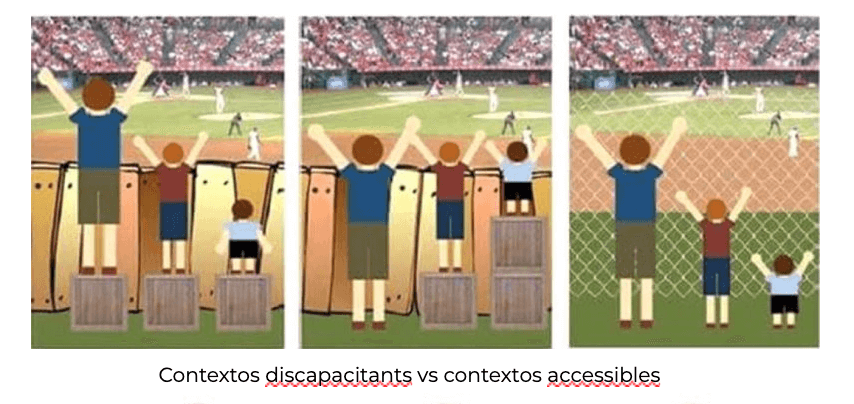
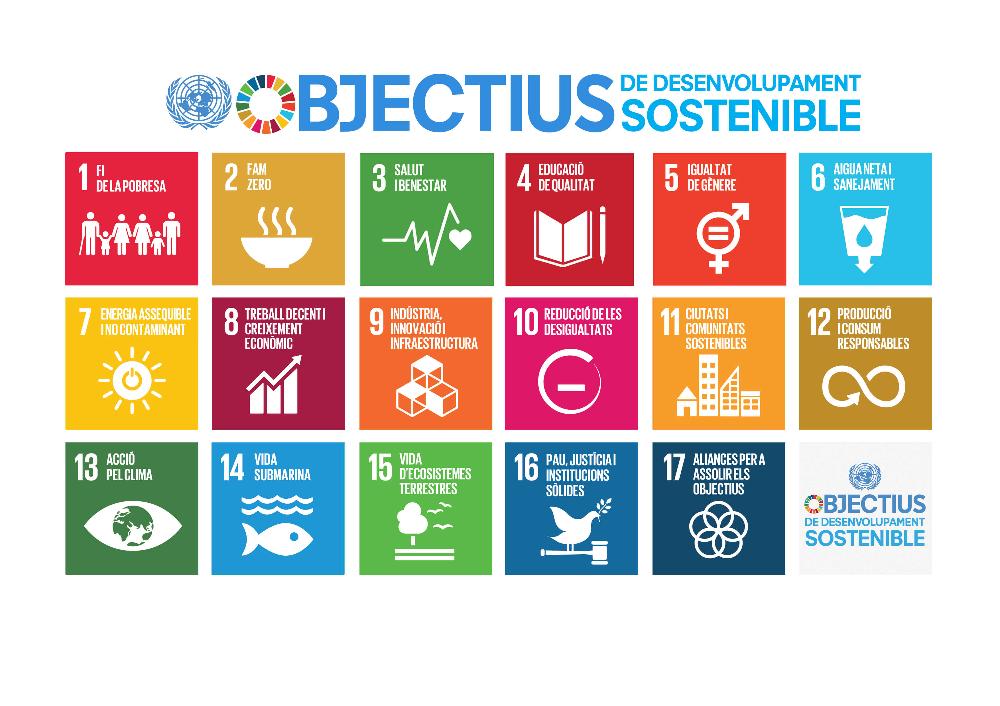
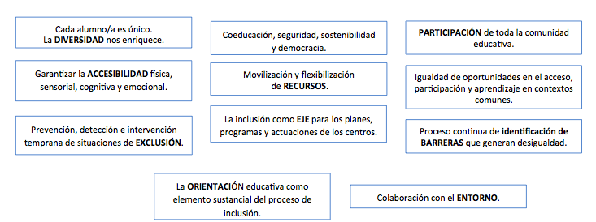
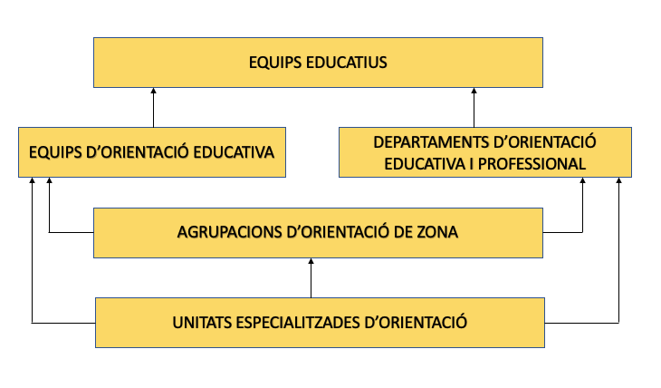
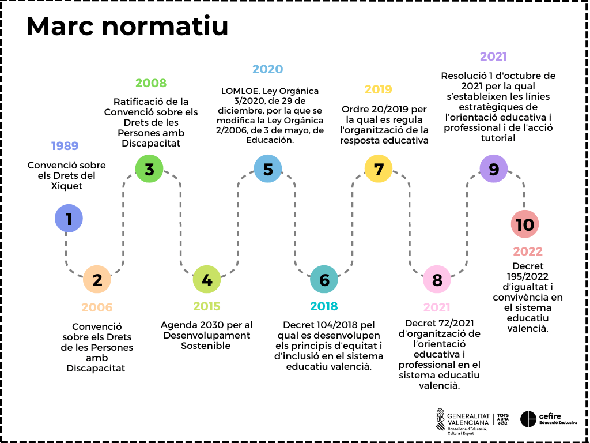
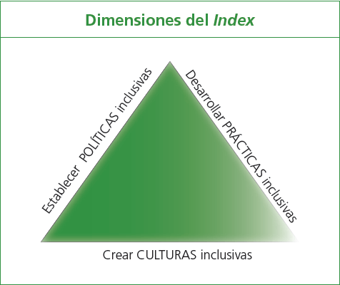
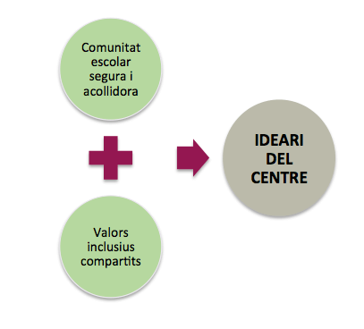

---
# Metainformació del document
title: IMPLICACIONS  D’UNA ESCOLA INCLUSIVA.
titlepage: true
subtitle: Versió per al curs de Markdown
author:
- Rocio Gallego Moreno
lang: ca
# portada
titlepage-rule-height: 2
titlepage-rule-color: 9beeef
titlepage-text-color: 00000a
titlepage-background: "imatges/portada.jpg"
logo: ./imatges/ODS.jpg
# configuració de l'índex

# capçalera i peu
header-left: \thetitle
header-right: Curs 2021-2022
footer-left: CEFIRE Valéncia
footer-right: \thepage/\pageref{LastPage}
# Les figures que apareguen on les definim i centrades
float-placement-figure: H
caption-justification: centering
# No volem numerar les linies de codi
listings-disable-line-numbers: true
# Configuracions dels paquets de latex
header-includes:
# imatges i subfigures
- \usepackage{graphicx}
- \usepackage{subfigure}
# - \usepackage{adjustbox}
# marca d'aigua
- \usepackage{draftwatermark}
- \SetWatermarkText{\includegraphics{./imatges/marca.jpeg}}
- \SetWatermarkScale{0.5}
- \SetWatermarkAngle{20}
# caixes d'avisos
- \usepackage{awesomebox}
# text en columnes
- \usepackage{multicol}
- \setlength{\columnseprule}{1pt}
- \setlength{\columnsep}{1em}
# pàgines apaïsades
- \usepackage{pdflscape}
# per a permetre pandoc dins de blocs Latex
- \newcommand{\hideFromPandoc}[1]{#1}
- \hideFromPandoc {
    \let\Begin\begin
    \let\End\end
    }
# definició de les caixes d'avis
pandoc-latex-environment:
noteblock: [note]
tipblock: [tip]
warningblock: [warning]
cautionblock: [caution]
importantblock: [important]
...
**1. QUINES IMPLICACIONS ES DERIVEN D'UNA ESCOLA INCLUSIVA?**

**1.1. Tres idees com a punt de partida**

Abans de començar és necessari deixar clares  **3 idees**  que han de vertebrar el discurs de la inclusió:

1. **La inclusió implica a tot l'alumnat**. Encara que la inclusió s'associa amb freqüència a l'atenció a l'alumnat amb discapacitat, realment té a veure amb tot l'alumnat en el moment present i futur, al llarg  de la seua vida i en tots els contexts (acadèmics, de convivència i de l'entorn).
2. **Tot l'alumnat en algun moment de la seua escolarització pot requerir suports** en diferent nivell, amplitud, intensitat i durada, per la qual cosa l'escola ha de planificar una resposta educativa des de l'inici.
3. No és tant l'alumnat el que presenta o té una discapacitat sinó que existeixen entorns discapacitants, és a dir, **és el context el que fa a la persona discapacitada.**

En aquest sentit, entenem que l'educació inclusiva és possible, és necessària i és urgent. Estem parlant de drets humans, d'una educació transformadora que millorarà la qualitat de vida de moltes persones, una educació que va més enllà de la mera socialització; estem parlant de societats inclusives, societats justes.

## 1.2. Marc conceptual i principals elements

**QUÈ ENTENEM PER UNA EDUCACIÓ INCLUSIVA?**

És la qüestió que abordarem, és a dir, intentarem aclarir el **marc conceptual i les implicacions** que es deriven d'una escola inclusiva, repassant els **4 elements principals** que assenyala la literatura sobre aquest tema.

> Nota: recordar que els processadors de text...

**Què és la inclusió?**

Prenem com a referència la definició que ens dóna la **UNESCO**** 1** (2005,p.15). Cal destacar que la defineix com un procés, que està orientat a respondre a la diversitat i se centra a potenciar i assegurar la presència, la participació i l'aprenentatge de cada estudiant, però sobretot d'aquells que són més vulnerables. A més, és essencial matisar que no fa referència explícita a alumnes amb NESE sinó alumnes que poden estar en una situació de vulnerabilitat i tots i totes, en algun moment, podem estar-ho.

Un error freqüent és considerar l'educació inclusiva com a sinònim d'integració. Hi ha matisos que diferencien a tots dos conceptes.

- La  **integració**  accepta la diferència, la reconeix però se centra en el dèficit, la deficiència o la discapacitat, per tant parla de necessitats educatives i planteja una resposta educativa que és diferenciadora. Diferenciadora en tant que l'alumne o alumna ix de l'aula ordinària per a rebre una atenció individualitzada en funció de la seua discapacitat, amb un currículum que s'allunya significativament de l'ordinari.
- En canvi una  **escola inclusiva**  acull la diferència i aprén d'ella, focalitzant l'atenció en les capacitats i potenciant-les, mitjançant l'eliminació de barreres que impedeixen que tots i totes puguen aprendre. En aquest sentit la resposta educativa és inclusiva i per tant l'alumne i l'alumna estan presents a l'aula ordinària, participant i aprenent al costat dels seus iguals i si és necessària es farà una personalització per a favorir els tres principis bàsics.

**Principals elements:**

Els quatre elements que repassa la literatura sobre aquest tema, son els següents:

1. La inclusió és un procés.
2. Hi ha tres principis fonamentals que s'han de garantir: presència, participació i aprenentatge.
3. L'escola inclusiva és especialment sensible a les situacions de risc d'exclusió i actua de manera especial amb l'alumnat més vulnerable.
4. Cobra especial importància la identificació de barreres.

**1. LA INCLUSIÓ ÉS UN PROCÉS**
De què parlem quan diem que la inclusió és un procés? Amb això, volem significar o ressaltar les següents idees:

1. **No és espontani** : l'educació inclusiva es construeix amb cada pas que anem donant. No sorgeix de sobte sinó que s'inicia amb actuacions consensuades.
2. **No és la suma d'accions puntuals** sinó el conjunt d'actuacions engranades.
3. **Requereix planificació** , és a dir, pensar com mobilitzarem els recursos que disposem en el centre.
4. Es **construeix a poc a poc**.
5. **És sistèmic** : totes les peces són fonamentals i funcionen si estan connectades entre si, si hi ha un treball en equip.
6. **És essencial la participació** : des del professor fins a l'alumne, les famílies i l'entorn.
7. Parteix del **paradigma d'investigació-acció** , és a dir, és un procés que mai acaba, que està en contínua revisió i requereix reflexió continuada.

**2. TRES PRINCIPIS: PRESÈNCIA, PARTICIPACIÓ I APRENENTATGE.**
Quins **3 principis** ha de garantir una educació inclusiva?

- **Presència** : significa que tots els/les nostres alumnes tenen garantit l'accés a l'escola i al currículum, que no excloem ni segreguem.
- **Participació** : significa que tot l'alumnat té oportunitats de participar en totes les experiències d'aprenentatge que ofereix l'escola, conviure i sentir-se part de la comunitat educativa.
- **Aprenentatge** : significa que tot l'alumnat aconsegueix el millor rendiment tenint en compte les seues necessitats, característiques i interessos.

**3. SITUACIONS DE RISC.**

El tercer element que fonamenta una educació inclusiva, és el que fa referència a les situacions de risc, és a dir, l'escola inclusiva es caracteritza per ser especialment sensible a les situacions de risc d'exclusió educativa i social i per tant, **actua de manera preferent amb l'alumnat més vulnerable.**

Un document audiovisual que exemplifica clarament com des de l'escola hem de ser acurats i evitar, amb les nostres actuacions, crear situacions de vulnerabilitat en el procés d'ensenyament aprenentatge, és el de la indefensió apresa.

Sobre aquest tema, també és clarificador el video [La farsa de l'avaluació](https://youtu.be/4tcZV07ZVz8),  un document audiovisual que, en format de paròdia, mostra com segons enfoquem les avaluacions, el professorat pot contribuir de manera significativa a reafirmar desigualtats, estereotips i en definitiva, a generar unes expectatives determinades en violar la confidencialitat de les dades personals o informació innecessària.

Els materials que adjuntem ací contenen activitats per a realitzar amb els equips educatius amb la finalitat de reflexionar sobre aquest tema i una guia sobre la confidencialitat en lectura fàcil, també interessant per al treball amb families i docents.

**4. IDENTIFICACIÓ DE BARRERES.**
I finalment, el quart element fa referència al concepte de barreres. Barreres que hi ha en el context i que influeixen negativament en el desenvolupament de les potencialitats de cada alumne i alumna, independentment de les seues característiques.

És el context el que fa a la persona discapacitada. Així, un mateix context pot ser discapacitant o accessible i això dependrà de la resposta que mobilitzem. I en parlar de barreres enllacem directament amb l'accessibilitat, la definició de la qual ens diu que qualsevol entorn, producte o servei ha de poder ser utilitzat pel major nombre de persones possible sense necessitat d'adaptacions. Sobre els tipus d'accessibilitat s'aprofundirà en un [altre apartat](https://aules.edu.gva.es/formaciodelprofessorat/mod/book/view.php?id=260764).

En qualsevol cas, des de l'escola, tot el professorat i els equips de suport a la inclusió, han de mobilitzar les eines necessàries per a aconseguir un context més accessible que garantisca la presència, la participació i l'aprenentatge.

En qualsevol cas, des de l'escola, tot el professorat i els equips de suport a la inclusió, han de mobilitzar les eines necessàries per a aconseguir un context més accessible que garantisca la presència, la participació i l'aprenentatge.

## 1.3. Marc normatiu

A continuació repassarem el marc normatiu que justifica l'educació inclusiva com un dret, i, posteriorment, els nivells de resposta educativa que queden recollits en la normativa autonòmica.

**MARC NORMATIU**
La idea clau és que l'educació inclusiva és un **dret**.
Encara parlem habitualment del principi d'inclusió, quan hauríem de parlar sempre del dret a una educació inclusiva, equitativa i de qualitat. Hi ha una gran diferència en aquesta conceptualització, ja que un principi orienta l'educació, fa referència a un aspecte ètic o moral que no em compromet a res, que no m'obliga. En canvi, entesa l'educació com un dret, implica compliment i, en conseqüència, hi ha un compromís jurídic.

El dret de tots els estudiants a una educació inclusiva no és un tema nou, és un tema no resolt des de fa quasi trenta anys. Es va parlar ja de dret a l'educació inclusiva en la **Convenció sobre els Drets del Xiquet** (ONU, 1989); també en la **Convenció sobre els Drets de les Persones amb Discapacitat** (ONU, 2006); i més recentment, en l' **Agenda 2030 per al Desenvolupament Sostenible** (ONU, 2015), on s'exigeix als països "_garantir una educació inclusiva, equitativa i de qualitat i promoure oportunitats d'aprenentatge durant tota la vida per a tot_s", impulsant d'aquesta forma, en la **Declaració de Incheon** , una nova visió de l'educació.

Els Objectius de Desenvolupament Sostenible (ODS) són una crida universal a l'adopció de mesures per a posar fi a la pobresa, protegir el planeta i garantir que totes les persones gaudisquen de pau i prosperitat.
Aquests 17 Objectius es basen en els assoliments dels Objectius de Desenvolupament del Mil·lenni.
Encara que hi ha un específic que es refereix a l'educació (el 4), com veiem hi ha molts que estan relacionats. Per exemple, el 5: igualtat de gènere o el 10 reducció de les desigualtats.

A continuació repassarem el marc normatiu que justifica l'educació inclusiva com un dret, i, posteriorment, els nivells de resposta educativa que queden recollits en la normativa autonòmica.

**MARC NORMATIU**
La idea clau és que l'educació inclusiva és un **dret**.
Encara parlem habitualment del principi d'inclusió, quan hauríem de parlar sempre del dret a una educació inclusiva, equitativa i de qualitat. Hi ha una gran diferència en aquesta conceptualització, ja que un principi orienta l'educació, fa referència a un aspecte ètic o moral que no em compromet a res, que no m'obliga. En canvi, entesa l'educació com un dret, implica compliment i, en conseqüència, hi ha un compromís jurídic.

El dret de tots els estudiants a una educació inclusiva no és un tema nou, és un tema no resolt des de fa quasi trenta anys. Es va parlar ja de dret a l'educació inclusiva en la **Convenció sobre els Drets del Xiquet** (ONU, 1989); també en la **Convenció sobre els Drets de les Persones amb Discapacitat** (ONU, 2006); i més recentment, en l' **Agenda 2030 per al Desenvolupament Sostenible** (ONU, 2015), on s'exigeix als països "_garantir una educació inclusiva, equitativa i de qualitat i promoure oportunitats d'aprenentatge durant tota la vida per a tot_s", impulsant d'aquesta forma, en la **Declaració de Incheon** , una nova visió de l'educació.

Els Objectius de Desenvolupament Sostenible (ODS) són una crida universal a l'adopció de mesures per a posar fi a la pobresa, protegir el planeta i garantir que totes les persones gaudisquen de pau i prosperitat.
Aquests 17 Objectius es basen en els assoliments dels Objectius de Desenvolupament del Mil·lenni.
Encara que hi ha un específic que es refereix a l'educació (el 4), com veiem hi ha molts que estan relacionats. Per exemple, el 5: igualtat de gènere o el 10 reducció de les desigualtats.

I un altre dels marcs internacionals de referència és la  **Convenció sobre els Drets de les Persones amb Discapacitat ** (maig 2008)

Espanya va ratificar en 2008 aquesta convenció pel que estem obligats al seu compliment. En ella els estats es comprometen a assegurar la igualtat en l'accés a l'educació, amb materials, tècniques i formes de comunicació adequats, mesures de suport pertinents i promovent la participació en societat.

En l'àmbit estatal, la **LOE** obri el camí en 2006 i el principi d'inclusió apareix per primera vegada en la normativa educativa. La [**LOMLOE**](https://www.boe.es/diario_boe/txt.php?id=BOE-A-2020-17264), actual llei vigent, continua el camí i termes com a accessibilitat universal, compensació de desigualtats, identificació de barreres, equitat van impregnant el text.

I en l'àmbit autonòmic, l'aprovació del [**Decret 104/2018**](https://dogv.gva.es/datos/2018/08/07/pdf/2018_7822.pdf) suposa un pas important. El Decret que desenvolupa els principis d'equitat i inclusió, inclou termes referits a la inclusió: barreres, accessibilitat, presència, participació, aprenentatge, disseny universal....

Hi ha **3 idees fonamentals** que es recullen al llarg del Decret:

1. L'educació inclusiva és un dret (idea que ja hem vist).
2. El focus canvia de l'alumnat a les barreres del context, és a dir, allò que limita la participació de l'alumne no és tant la seua falta de capacitats com la inaccessibilitat al context, per això cal analitzar i avaluar les barreres.
3. La participació de tota la comunitat és garantia d'èxit. Aquesta participació s'àmplia en el radi i no és responsabilitat única de l'especialista.

A més, en el seu article 3, recull els **principis** en els quals s'ha de basar l'educació inclusiva. Podem observar, de nou, que s'utilitza un llenguatge diferent del que la normativa sobre atenció a la diversitat ens tenia acostumats.

En l'article 4 es recullen les **línies d'actuació** que faran possible el desenvolupament dels onze principis:

1. La primera fa referència a la identificació i eliminació de barreres en el context.
2. La segona fa referència a la necessitat de mobilitzar els recursos del nostre centre per a respondre a la diversitat, afecta per tant a l'organització de centre, a les polítiques del centre.
3. La tercera al·ludeix al fet d'integrar en l'ideari del centre la inclusió com a dret, incloent tots aquells valors que garanteixen la consolidació d'una cultura inclusiva.
4. I la quarta fa referència al desenvolupament d'un currículum per a la inclusió i per tant, al·ludeix a què puc fer a l'aula per a assegurar que tot l'alumnat puga participar i aprendre.

Una altra de les referències autonòmiques de rellevància és l'[Ordre 20/2019](https://dogv.gva.es/datos/2019/05/03/pdf/2019_4442.pdf) **,** per la qual es regula l'organització de la resposta educativa.  Les mesures de resposta educativa per a la inclusió, s'organitzen en 4 nivells de concreció, que són de caràcter sumatori i progressiu.

Per altra banda, cal tindre en compte el [Decret 72/2021](https://dogv.gva.es/datos/2021/06/03/pdf/2021_6157.pdf) d'organització de l'orientació educativa i professional en el sistema educatiu valencià. Tota la informació queda recollida en la web: [https://ceice.gva.es/es/web/inclusioeducativa/organitzacio-de-l-orientacio](https://ceice.gva.es/es/web/inclusioeducativa/organitzacio-de-l-orientacio)

En l' **article 3**  es defineix que l'orientació educativa i professional s'estructura en  **quatre tipus d'intervenció** , d'acord amb les seues característiques i els equips que hi participen:

1. El  **primer tipus d'intervenció**  correspon als equips educatius dels centres docents, coordinats pel professorat tutor dels diferents grups d'alumnat, i es du a terme a través de la docència i la tutoria.

2. El  **segon tipus d'intervenció ** el constitueixen els equips d'orientació educativa dels centres docents d'educació infantil i primària i d'educació especial de titularitat de la Generalitat i els departaments d'orientació educativa i professional dels centres docents d'educació secundària sostinguts amb fons públics, que ofereixen un suport especialitzat a l'alumnat, al professorat i a les famílies.

3. El  **tercer tipus d'intervenció**  el realitzen les agrupacions d'orientació de zona, les quals interconnecten els equips d'orientació educativa i els departaments d'orientació educativa i professional, a fi de garantir l'orientació al llarg de les diferents etapes, alhora que interactuen amb les institucions de l'entorn sociocomunitari pròxim.

4. El  **quart tipus d'intervenció**  el conformen les unitats especialitzades d'orientació, que donen suport extern als centres docents, als equips d'orientació educativa, als departaments d'orientació educativa i professional i a les agrupacions d'orientació de zona.

Més informació sobre les UEO en aquest enllaç: [https://ceice.gva.es/es/web/inclusioeducativa/unitats-especialitzades-d-orientacio](https://ceice.gva.es/es/web/inclusioeducativa/unitats-especialitzades-d-orientacio)

Finalment, cal tindre en compte la [RESOLUCIÓ d'1 d'octubre de 2021,](https://dogv.gva.es/datos/2021/10/05/pdf/2021_9988.pdf) de la directora general d'Inclusió Educativa, per la qual s'estableixen les  **línies estratègiques de l'orientació educativa i professional i de l'acció tutorial**  per al curs 2021-2022 (vigents les 4 línies):

1.  **Ensenyament-aprenentatge** : L'objectiu principal de l'orientació en el procés d'ensenyament i aprenentatge és donar suport en el desenvolupament d'un currículum per a la inclusió. Aquest acompanyament requereix assessorar i donar suport als equips educatius, de forma col·laborativa, per millorar les condicions d'aprenentatge i afavorir l'èxit escolar de tot l'alumnat.

2.  **Igualtat i convivència** : L'objectiu principal de l'orientació en la igualtat i la convivència és participar en la planificació, el desenvolupament i l'avaluació de programes, actuacions i mesures orientades a la promoció de la igualtat, la coeducació, la diversitat sexual, de gènere i familiar, la convivència, la comunicació no violenta, la prevenció de conflictes i la gestió i resolució pacífica d'aquests. Es prestarà especial atenció a la violència de gènere, la igualtat en la diversitat i la no discriminació, tot atenent i respectant les circumstàncies, condicions i característiques personals de l'alumnat i de les famílies. En aquest sentit, caldrà tindre en compte el nou marc legislatiu que regula la igualtat i convivència: [DECRET 195/2022, d'11 de novembre, del Consell, d'igualtat i convivència en el sistema educatiu valencià.](https://dogv.gva.es/datos/2022/11/16/pdf/2022_10681.pdf)

3.  **Transició i acollida:**  L'objectiu principal de l'orientació en la transició i l'acollida és donar suport i assessorar en els processos de transició entre nivells, cicles, etapes i modalitats d'escolarització per tal de garantir l'acompanyament a l'alumnat i a les famílies, el transvasament d'informació, la continuïtat de les actuacions educatives i la detecció de necessitats que poden produir-se en moments en que les barreres i les desigualtats es manifesten amb més freqüència i intensitat. Implica també les actuacions que afavoreixen l'acollida de tota la comunitat educativa.

4.  **Orientació acadèmica i professional** : L'objectiu principal de l'orientació acadèmica i professional és potenciar la maduresa vocacional i l'auto orientació de l'alumnat, en un procés d'assessorament a l'alumnat i les famílies en què es faciliten els recursos necessaris per a afavorir l'autoconeixement, s'ofereix informació sobre les diferents opcions acadèmiques i professionals i s'ajuda en la presa de decisions de manera responsable i lliure de biaixos de gènere o de qualsevol altre tipus.

A continuació, es mostra una infografia que arreplega tot el marc normatiu.

## 1.4. Dimensions d'una escola inclusiva

La Guia per a l'Educació Inclusiva, que és la traducció del Index for Inclusion de Tony Booth i Mel Ainscow, assenyalen **3 dimensions:**
         1. Cultures
         2. Polítiques
         3. Pràctiques

De fet, la guia s'estructura en funció de les 3 dimensions: 1. **Crear CULTURES INCLUSIVES;** 2. **Elaborar POLÍTIQUES INCLUSIVES** i 3. **Desenvolupar PRÀCTIQUES INCLUSIVES**.

Les tres dimensions formen un triangle per a simbolitzar la connexió entre elles.

**Quin significat té cadascuna de les dimensions? Quines son les principals implicacions?**

**CULTURES INCLUSIVES:**

En primer lloc, què implica dinamitzar cultures inclusives en el centre educatiu?
Si bé la dimensió cultural està orientada cap a la reflexió sobre la importància de crear comunitats escolars segures, acollidores i col·laboradores i la consolidació de valors inclusius compartits, la qual cosa conformaria  **l'IDEARI DEL CENTRE.**

Les **implicacions** que es deriven, entre altres, són:

1. La comunitat educativa (professorat, alumnat i famílies) ha d'obrir un debat per a reflexionar, consensuar i establir, de forma col·laborativa i democràtica, quins valors s'impulsaran des del centre.
2. Els valors inclusius que es determinen han de formar part del Projecte Educatiu.
3. En el Projecte Educatiu cal determinar les actuacions que es duran a terme per al seu efectiu compliment.
4. La base de totes les actuacions ha de ser el diàleg igualitari i la col·laboració.
5. S'ha de desenvolupar un protocol d'acolliment perquè qualsevol membre de la comunitat educativa se senta part d'aquesta.

Per a començar a reflexionar sobre la dimensió cultural en el nostre centre, seria idoni donar resposta a les següents **reflexions** :

- Quins valors educatius doten d'identitat al nostre centre i si aquests estan recollits en el Projecte Educatiu de forma consensuada.
- Si hi ha establit un pla d'acolliment per als diferents membres de la comunitat educativa.
- Si l'equip directiu exerceix un lideratge pedagògic i compartit, on es dóna veu a tots els membres.
- Si el centre està obert a l'entorn, és a dir, té en compte les possibilitats que li ofereix.
- De quina manera s'afavoreix la participació de les famílies en el centre.
- I, finalment, si el professorat parteix d'una valoració igual a tot l'alumnat amb altes expectatives per a cadascun d'ells.

Aquestes i altres qüestions, que també es recullen en la Guia per a l'Educació Inclusiva, amb una sèrie de preguntes específiques, ens ajuden a reflexionar sobre la dimensió cultural i, d'alguna manera, haurien de plasmar-se en el Projecte Educatiu a partir del consens entre els membres de la comunitat educativa.

**POLÍTIQUES INCLUSIVES**** :**

La segona dimensió, fa referència les polítiques del centre i implica reflexionar sobre  **COM ES GESTIONA**  el centre, és a dir:

1. Quina organització interna està funcionant
2. Quins plans i programes es duen a terme
3. Com es mobilitzen i distribueixen els recursos.

Per tant, la **reflexió** dels membres de la comunitat educativa ha de girar entorn a qüestions com:

- El funcionament del centre.
- Quina organització dels suports es promou per a afavorir la inclusió de tot l'alumnat.
- Quin ús es fa dels espais i els temps.
- En quina mesura els documents del centre són documents vius i consensuats i recullen aspectes pedagògics que donen resposta a la diversitat de l'alumnat.

I igual que en la dimensió anterior, hi ha una sèrie de qüestions (que ampliades en l'esmentada Guia), ens poden ajudar a reflexionar sobre la dimensió política:

- S'han tingut en compte criteris pedagògics per a configurar els grups o s'han format aleatòriament?
- I els tutors i tutores, s'han consensuat una sèrie de criteris per a l'assignació de grups o recauen en qualsevol professor/a encara que manque de formació, experiència i habilitats?
- Hi ha hagut prèviament un consens sobre aquests criteris amb l'equip directiu?
- I finalment, com s'organitzen els suports?, es realitzen sempre fora de l'aula?, l'estructura organitzativa promou la docència compartida?, el suport es dóna a la totalitat de l'alumnat?, es creen xarxes de suport que afavoreixen l'atenció de tot l'alumnat?, el suport és responsabilitat de qualsevol professor/a o només dels/les especialistes?

Aquestes qüestions no solament es plasmaran en el Pla d'Atenció a la Diversitat i Inclusió Educativa (PADIE), sinó que ha de formar part del PAT, de la PGA, del Pla de Transició i tots aquells documents que interfereixen en l'estructura organitzativa del centre.

**PRÀCTIQUES INCLUSIVES:**

I finalment, la tercera, convida a repensar i reflexionar sobre les pràctiques inclusives, és a dir, què faig jo com a docent a l'aula per a afavorir un  **CURRÍCULUM PER A LA INCLUSI**** Ó? **Això requereix reflexionar sobre què i com s'aprén i s'ensenya i, de forma necessària, sobre què i com s'avalua.

Per tant, **implica** que el professorat:

1. Treballe de forma col·laborativa i faça visible les seues bones pràctiques.
2. Aplique els principis del Disseny Universal i per tant tinga una formació de qualitat sobre aquest tema, ja que això garanteix l'accessibilitat en l'aprenentatge, en tant que permet, des de l'inici, dissenyar programacions didàctiques i entorns d'aprenentatge universals i accessibles.
3. Dinamitze metodologies inclusives que promoguen que la participació i l'aprenentatge de tot l'alumnat, que fomenten l'autonomia en l'aprenentatge i l'esperit crític i afavorisca el desenvolupament de competències socials, emocionals, cognitives i dialògiques.

Finalment, les **qüestions** que ens ajudarien a treballar sobre la dimensió pràctica, podrien ser les següents:

- El professorat ha planificat des de l'inici situacions d'aprenentatge de les quals pot participar i aprendre tot l'alumnat?
- L'aprenentatge col·laboratiu i/o cooperatiu és una metodologia de treball o només predomina la instrucció directa?
- I les avaluacions, garanteixen l'aprenentatge de tot l'alumnat?, es té en compte que determinats/des alumnes requereixen adaptacions?, l'avaluació promou l'aprenentatge o és purament sumativa?

Totes aquestes qüestions haurien de reflectir-se en les programacions, de manera que es garantisca una resposta educativa inclusiva amb un disseny universal del currículum.

## Recursos per saber-ne més

[Guía FEVAS "Escuela Inclusiva: únete al reto"](https://fevas.org/?wpfb_dl=146): afavoreix la reflexió i ofereix pautes concretes per a avançar cap a una escola inclusiva. S'aborden, entre altres qüestions, els passos donats en el camí de l'exclusió a la inclusió; la inclusió com a filosofia orientadora; claus i recursos per a promoure inclusió; i les famílies i l'alumnat com a agents actius en l'educació.

[Curs MEC. Educación Inclusiva. Iguales en la Diversidad](http://www.ite.educacion.es/formacion/materiales/126/cd/): material de formació que conté 10 mòduls i que afavoreix l'anàlisi de les pròpies concepcions i pràctiques, perquè aquestes tinguen una orientació inclusiva i que, al seu torn, servisquen per a promoure canvis.

[Curs MEC. Educación Inclusiva](http://www.ite.educacion.es/formacion/materiales/72/cd/index.html): material de formació que conté 3 unitats, l'objectiu de les quals és abordar el concepte d'escola inclusiva i els seus fonaments; analitzar críticament els components organitzatius i de funcionament d'un centre inclusiu i proporcionar eines per a l'elaboració de les programacions i de les adaptacions curriculars individualitzades en una aula inclusiva.